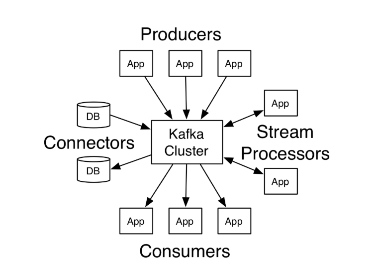

##### Note : Assuming running this command from kafka path such as **c:/apps/kafka**

## Start Zookeper 
  - Windows : .\bin\windows\zookeeper-server-start.bat .\config\zookeeper.properties
  - Linux : bin/zookeeper-server-start.sh config/zookeeper.properties

## Now start the Kafka server
  - Windows : .\bin\windows\kafka-server-start.bat .\config\server.properties
  - Linux : bin/kafka-server-start.sh config/server.properties
  
## Create Topic
##### topic named "test" with a single partition and only one replica:

- Windows : .\bin\windows\kafka-topics.bat --create --bootstrap-server localhost:9092 --replication-factor 1 --partitions 1 --topic test
- Linux : bin/kafka-topics.sh --create --bootstrap-server localhost:9092 --replication-factor 1 --partitions 1 --topic test

#### We can now see that topic if we run the list topic command
  - Windows : .\bin\windows\kafka-topics.bat --list --bootstrap-server localhost:9092
  - Linux : bin/kafka-topics.sh --list --bootstrap-server localhost:9092
    > **Output : test**
 
 ## Send some messages
 - Windows : .\bin\windows\kafka-console-producer.bat --broker-list localhost:9092 --topic test
 - Linux : bin/kafka-console-producer.sh --broker-list localhost:9092 --topic test 
 > This is my First Message
 
 ## Start a consumer and consume
 - Windows : .\bin\windows\kafka-console-consumer.bat --bootstrap-server localhost:9092 --topic test --from-beginning
 - Linux : bin/kafka-console-consumer.sh --bootstrap-server localhost:9092 --topic test --from-beginning
 > This is my First Message
 
 ## Setting up a multi-broker cluster
 ##### Going forward just gonna put example considering Linux environment, TO run on windows just change the path and exe file.
 - rename the server propery and change the configuration 
   - **rename :** 
     > cp config/server.properties config/server-1.properties
   - **Config changes :**
     > config/server-1.properties: \
       broker.id=1 \
       listeners=PLAINTEXT://:9093 \
       log.dirs=/tmp/logs
   - **Starting new Kafka instance**
     > bin/kafka-server-start.sh config/server-1.properties &
   - **create a new topic with a replication factor of three**
    > bin/kafka-topics.sh --create --bootstrap-server localhost:9092 --replication-factor 3 --partitions 1 --topic my-replicated-topic
   - To see Which broker is doing what 
     - bin/kafka-topics.sh --describe --bootstrap-server localhost:9092 --topic my-replicated-topic
     > Topic:my-replicated-topic   PartitionCount:1    ReplicationFactor:3 Configs:
      Topic: my-replicated-topic  Partition: 0    Leader: 1   Replicas: 1,2,0 Isr: 1,2,0
      -  > Here is an explanation of output. The first line gives a summary of all the partitions, each additional line gives information               about one partition. Since we have only one partition for this topic there is only one line.
           - > **LEADER** is the node responsible for all reads and writes for the given partition. Each node will be the leader for a                      randomly selected portion of the partitions.
           - > **REPLICAS** is the list of nodes that replicate the log for this partition regardless of whether they are the leader or even                if they are currently alive.
           - > **ISR** is the set of "in-sync" replicas. This is the subset of the replicas list that is currently alive and caught-up to                   the leader.
    
